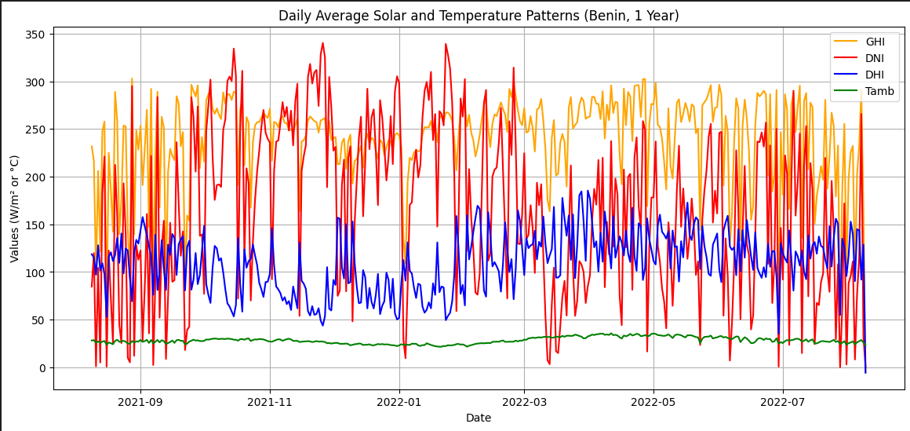
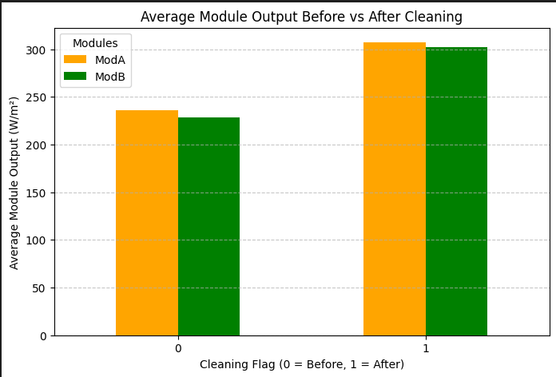
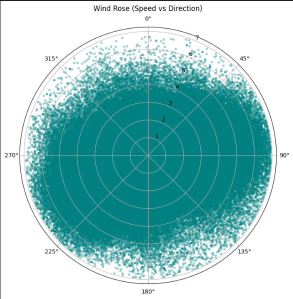
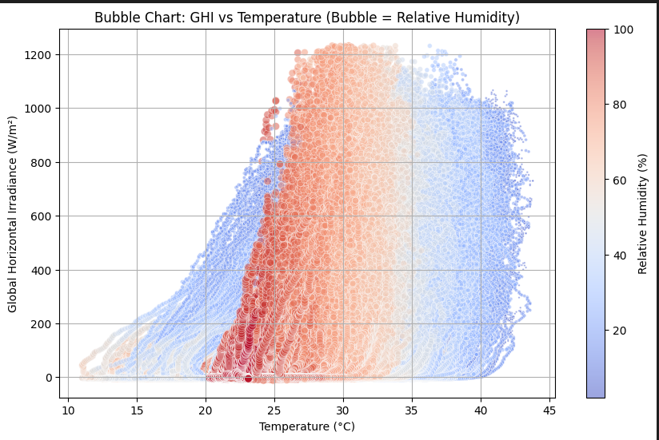

# solar-challenge-week0
# 🌞 Solar Challenge Week 0

## 🧰 Environment Setup

1. Clone the repo:
   ```bash
   git clone https://github.com/<your-username>/solar-challenge-week0.git
   cd solar-challenge-week0
# Interim Report

I’m working on the Solar Challenge Week 0 project, focusing on solar radiation datasets from **Benin**, **Sierra Leone**, and **Togo**.  
The goal of this phase was to establish version control best practices, create a clean analysis environment, and perform initial data profiling and exploration for each country’s dataset.

Below is a summary of the work and approaches I used for this week.

---

## Task 1: Git & Environment Setup

I started by creating a GitHub repository named `solar-challenge-week0` and worked on a branch called `setup-task`.  
Here’s what I completed in this stage:

- Created a `.gitignore` file to exclude `data/`, `.csv`, and `.ipynb_checkpoints/` folders.
- Set up a Python virtual environment and listed dependencies in `requirements.txt` (including `pandas`, `numpy`, `matplotlib`, `seaborn`, and `scipy`).
- Added a GitHub Actions CI workflow to automate environment setup and verify dependencies on every push.
- Organized the folder structure with directories for `notebooks/`, `scripts/`, `tests/`, and `.github/workflows/`.
- Documented setup and environment reproduction steps in `README.md`.

This setup ensures that the project is reproducible, organized, and ready for collaborative work. Once CI passed successfully, I merged the `setup-task` branch into the `main` branch through a pull request.

---

## Task 2: Data Profiling, Cleaning & EDA

After setup, I moved on to data exploration and cleaning for each country’s solar dataset, starting with the branch `eda-benin`.

### Summary Stats & Missing Values
- Generated summary statistics using `df.describe()`.
- Identified columns with missing data using `df.isna().sum()`.
- Columns with more than **5% missing values** were flagged for review.

### Outlier Detection
- Computed Z-scores for key columns such as `GHI`, `DNI`, `DHI`, `ModA`, `ModB`, `WS`, and `WSgust`.
- Flagged values where `|Z| > 3`.
- Handled outliers by replacing them with the **median** of the respective columns to preserve data consistency.

### Data Cleaning
- After imputation, the cleaned data was exported to `data/benin_clean.csv`.
- The `/data` directory was kept out of version control to prevent committing large CSV files.

### EDA Highlights

- **Time series plots** for `GHI`, `DNI`, `DHI`, and temperature trends.  
  Visualized solar radiation and temperature trends using **daily averages** of `GHI`, `DNI`, `DHI`, and `Tamb`. This helped identify daily and monthly patterns, as well as anomalies such as sudden peaks in irradiance or temperature drops.
  

- **Cleaning impact**: Compared `ModA`/`ModB` readings before & after cleaning.  
  Grouped the data by the `Cleaning` flag and compared sensor readings to observe how performance changed post-cleaning.



- **Correlation heatmaps and scatter plots** for key variables.  
  Explored relationships between `GHI`, `DNI`, `DHI`, temperature, humidity, and wind speed.  
  - Humidity showed some **negative correlation** with temperature and solar radiation.  
  - Higher wind speeds occasionally aligned with **lower irradiance**.

- **Wind distribution and humidity–temperature interaction analysis**.  
 
- **Bubble charts** to show relationships between temperature, humidity, and irradiance.


### Outcome
- Clean, analysis-ready datasets.
- Initial visual insights into solar and environmental patterns.

---

## Next Steps and Anticipated Challenges

Moving forward to **Task 3 (Cross-Country Comparison)**, I plan to merge the cleaned datasets and perform comparative analysis across countries using statistical summaries and boxplots.

### Potential Challenges:
- Ensuring consistent column naming and units across all datasets.
- Handling potential data gaps in certain time periods.
- Managing computational load due to large dataset sizes.

### Mitigation Strategies:
- Standardize column names and data types during the data loading stage.
- Use efficient `pandas` operations and sampling techniques to manage memory.
- Validate consistency in measurement units before aggregation.

These proactive steps will ensure a smoother transition into cross-country comparisons and reliable analysis results.